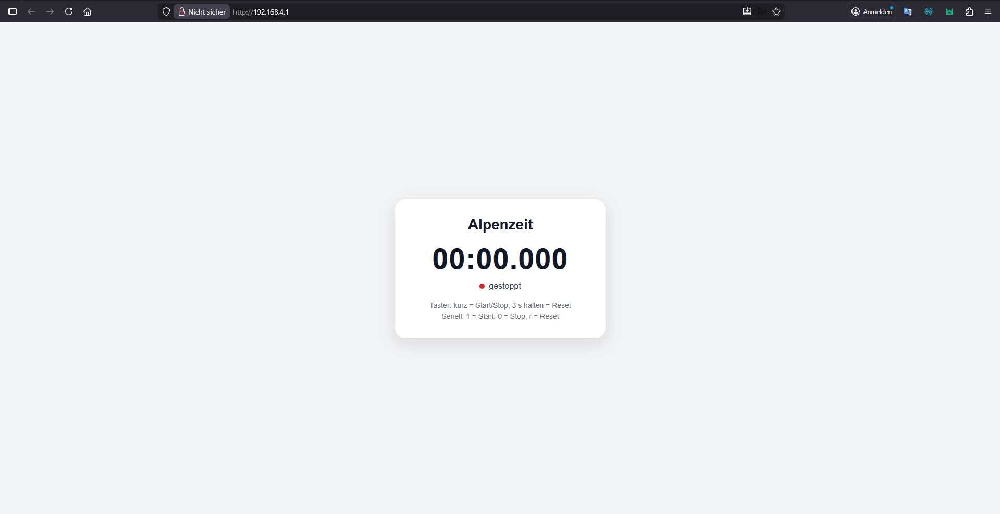
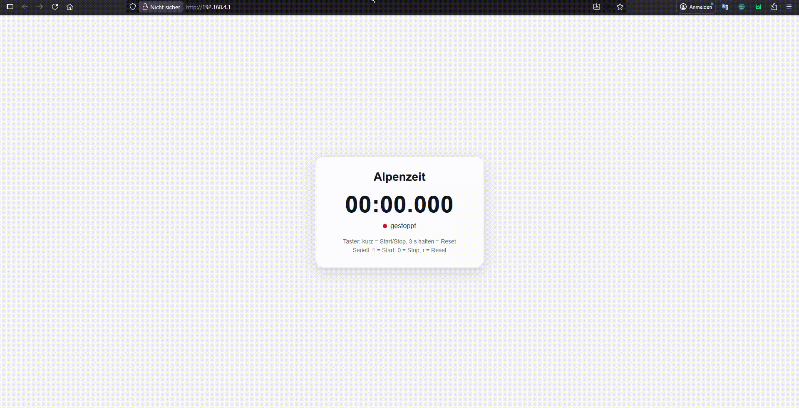
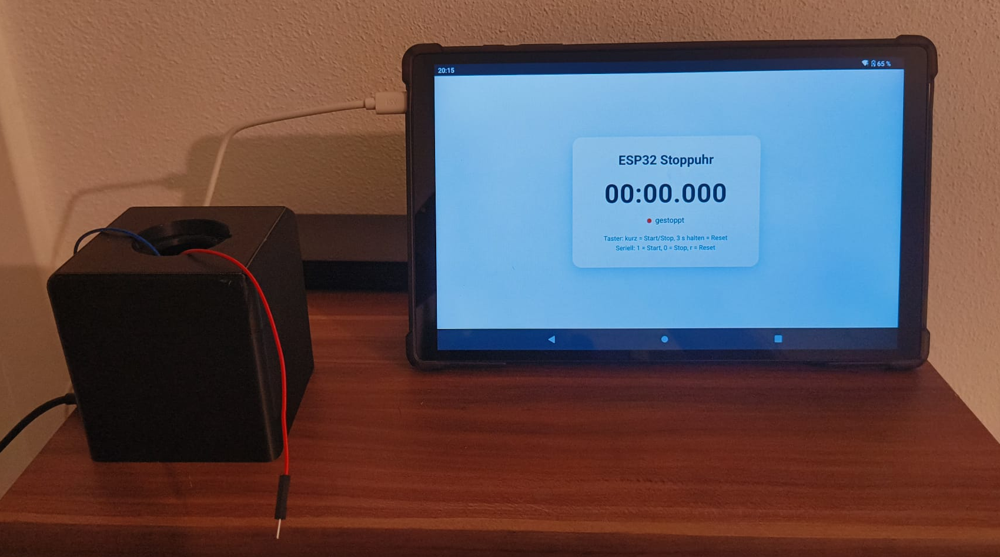
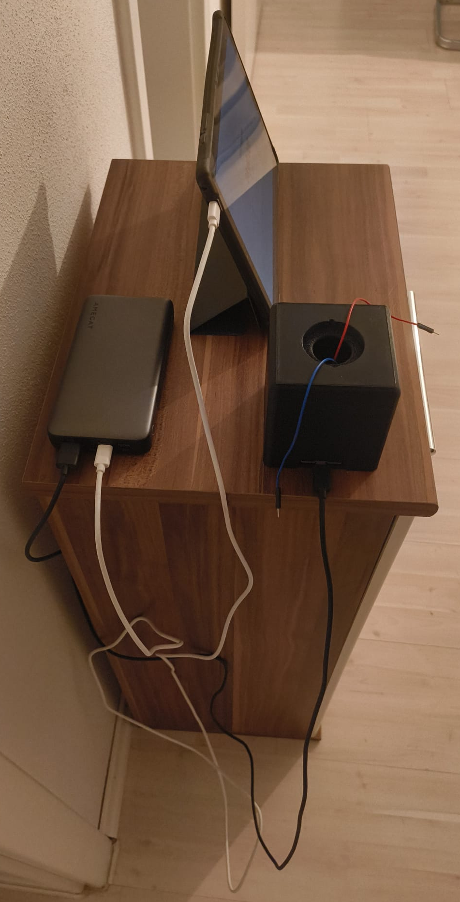

# Alpenzeit


ESP32-based timer with Wi-Fi access point, push button control and a modern web interface with real-time updates via WebSockets.

---

## 📸 Demo

### Web Interface



### Live Timer (GIF)



---

## ✨ Features

* ⏱️ Timer / stopwatch with millisecond precision
* 📡 Built-in Wi-Fi access point (no router required)
* 🌐 Browser-based web interface (mobile & desktop)
* 🔄 Real-time updates via WebSocket
* 🔘 Hardware button control
* 💻 Serial control interface

---

## 🧰 Hardware

* ESP32
* Push button

### 🔌 Wiring

```
3V3 ─── Button ─── GPIO27
```

👉 GPIO27 is configured as `INPUT_PULLDOWN`




---

## 🎮 Controls

### 🔘 Button

* **Short press** → Start / Stop
* **Hold for 3 seconds** → Reset

### 💻 Serial (115200 baud)

| Command | Function |
| ------- | -------- |
| `1`     | Start    |
| `0`     | Stop     |
| `r`     | Reset    |

---

## 🌐 Web Interface

After boot, the ESP32 creates a Wi-Fi network:

* **SSID:** `AlpenZeit`
* **Password:** `alpenzeit2026`

👉 Open in your browser:

```
http://192.168.4.1
```

---

## ⚙️ How It Works

* ESP32 runs in **Access Point mode**
* HTTP server serves the web interface
* WebSocket server streams live data
* Frontend interpolates time for smooth display
* Button input is **debounced + long-press detected**

---

## 📁 Project Structure

```
Alpenzeit/
├── Alpenzeit.ino
├── index_html.h
├── docs/
│   ├── webui.png
│   └── demo.gif
└── README.md
```

---

## 🚀 Installation

1. Open the project in Arduino IDE
2. Select your ESP32 board
3. Upload the code
4. Connect to Wi-Fi `AlpenZeit`
5. Open `192.168.4.1` in your browser

---

## 📦 Dependencies

Required Arduino libraries:

* `WiFi.h`
* `WebServer.h`
* `WebSocketsServer.h`

⚠️ **Important:**
You must manually install:

👉 **WebSockets by Markus Sattler**

Install via Arduino IDE:

1. Open Library Manager
2. Search for **WebSockets**
3. Install *WebSockets by Markus Sattler*

---

## 📄 License

This project is intended for private and non-commercial use only.

---

## 👤 Author

flox86
